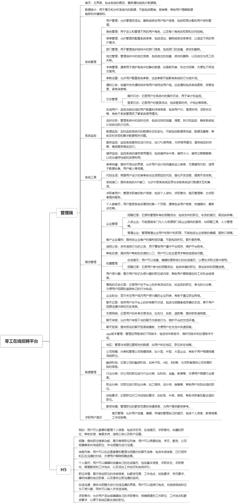

 

    
 

公司拥有上百套具有自主知识产权的软件系统，详情请查看码云首页或公司官网

 
<h1>灵活用工招聘平台</h1>

<a href="https://www.haishi.net.cn/">公司官网</a> ｜ <a href="https://www.haishi.net.cn/">在线体验</a>

 

## 系统介绍

零工在线招聘平台，在线发布简历，在线发布岗位，在线投递，一对一沟通等功能，支持H5
本项目名称为灵活用工招聘平台，是一款面向企业和求职者的招聘平台，旨在为企业提供高效便捷的招聘服务，为求职者提供丰富的就业机会。该平台提供从企业信息管理、职位发布、简历筛选、在线沟通到招聘数据统计分析等一站式招聘解决方案，帮助企业快速找到合适的人才，提高招聘效率。
本项目从用户层面可以分为两个端：
- 管理端：企业用户使用，可以进行招聘信息管理、用户管理、数据统计等
- 用户端（推测）：求职者用户使用，可以浏览职位信息、投递简历、收藏职位等
                

## 系统功能介绍

### 系统包含终端说明

管理端（WEB）、用户端（H5）

| 序号 | 模块                 | 模块说明 |
| ---- | -------------------- | -------- |
| 1    | QHY-ZPPT-LGZP-SERVER | 服务端   |
| 2    | QHY-ZPPT-LGZP-H5     | H5端     |
| 3    | QHY-ZPPT-LGZP-MANAGE | 管理端   |

### 系统功能结构

### 系统功能说明

- 招聘管理：包括职位发布、简历筛选、招聘记录管理等功能，方便企业进行招聘管理。
- 用户管理：包括用户管理、角色管理、权限管理等功能，保障平台安全稳定运行。
- 数据统计：提供招聘数据统计分析功能，帮助企业了解招聘情况，优化招聘策略。
- 刷活管理：对求职者用户、个人端首页轮播、违规公告等进行管理，维护平台秩序。
- 收藏管理：用户可以收藏感兴趣的职位和简历，方便后续查看和联系。

## 系统主要界面

## 系统技术说明

### 代码模块说明

| 序号 | 目录                           | 目录说明 |
| ---- | ------------------------------ | -------- |
| 1    | QHY-ZPPT-LGZP-SERVER/bin       | --       |
| 2    | QHY-ZPPT-LGZP-SERVER/px-job    | --       |
| 3    | QHY-ZPPT-LGZP-SERVER/px-common | --       |
| 4    | QHY-ZPPT-LGZP-SERVER/px-admin  | --       |

### 系统技术选型

#### 开发语言/框架

JAVA（JDK1.8）
前端框架：VUE2

#### 服务中间件

Nginx
Tomcat

#### 数据库

MySQL（5.7+）

#### 其他说明

无

## 系统演示/商用

请扫码添加客服微信获取演示地址和系统详细资料。

如果您想基于灵活用工招聘平台进行商业化交付或定制开发服务，我们提供有偿的技术服务支持，合作模式不限，欢迎沟通！

公司官网地址： <a href="https://www.haishi.net.cn/">https://www.haishi.net.cn</a>

联系客服获取专业回答。

## 使用须知

1、 本项目商用必须获得版权所有者的授权。

2、 未经允许本项目代码不允许二次出售。

